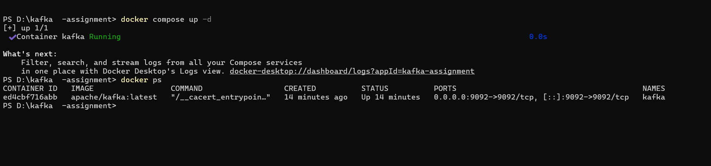
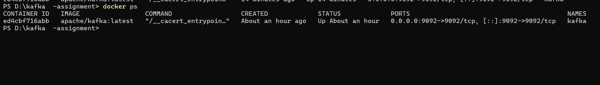
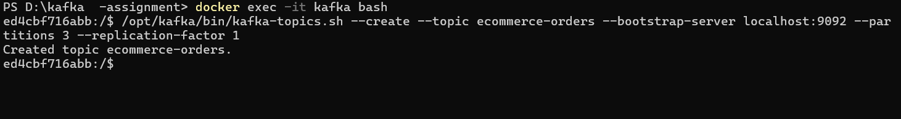
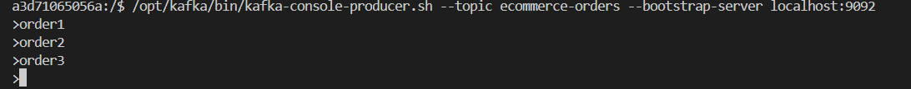
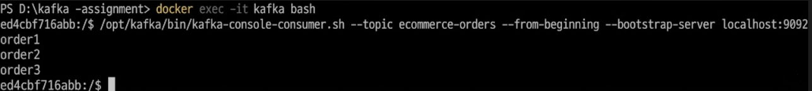
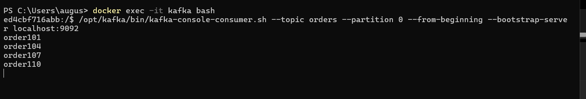
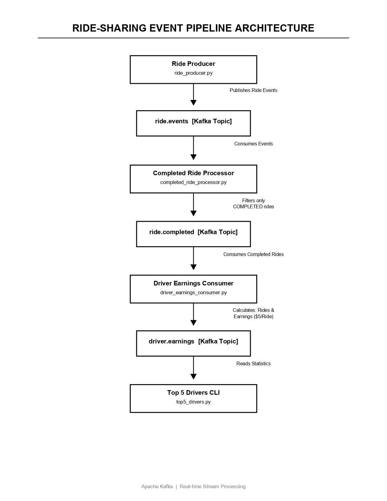
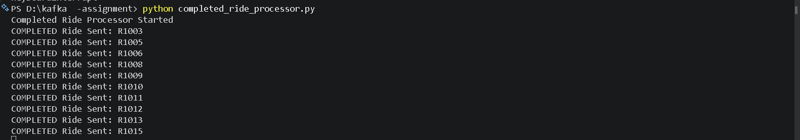
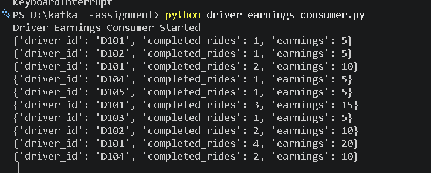
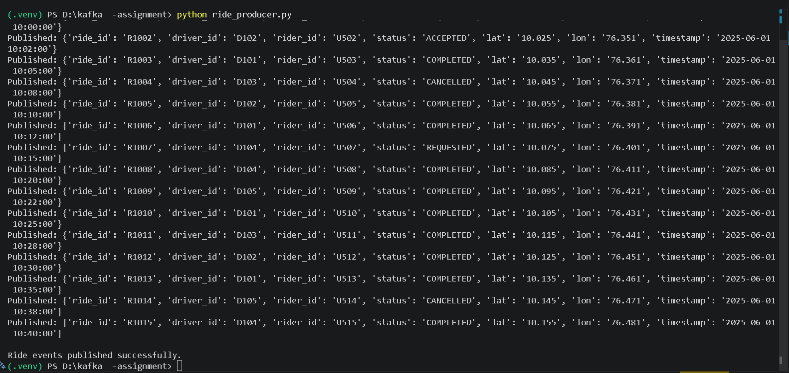

# Apache Kafka Projects

## Author
**Augustine Shaji**

---

# Project Overview

This repository contains two Apache Kafka projects implemented using Python, Docker, and Kafka.

## Technologies Used

- Apache Kafka
- Python
- kafka-python
- Docker
- GitHub

---

# Project 1: E-Commerce Event Processing

A Kafka-based order processing system demonstrating Kafka fundamentals.

## Features

- Kafka Producer
- Kafka Consumer
- Consumer Groups
- Partition Rebalancing
- Poison Message Handling
- Dead Letter Topic Design

## Kafka Topic

```text
ecommerce.orders
```

## Workflow

```text
orders.csv
    ↓
Producer
    ↓
ecommerce.orders
    ↓
Consumer Group
    ↓
Analytics
```

---

# Task 1.2 - Kafka Setup

## Kafka Broker Started



## Docker Verification



## Topic Creation



## Message Production



## Message Consumption



---

# Task 1.3 - Topic Creation and Partition Consumption

## Topic Description


## Producing Messages with Keys


## Consuming Messages from Partition 0



---

# Task 2.1 - CSV Producer

Producer reads records from CSV and publishes them to Kafka.

## Producer Execution


## Published Records


---

# Task 2.2 - Consumer Analytics

Consumer reads messages and maintains a running order count.

## Consumer Output


## Running Count


---

# Task 2.3 - Consumer Group Rebalancing

Two consumer instances were started in the same group.

## Consumer Instance 1


## Consumer Instance 2


---

# Task 2.4 - Poison Message Handling

Invalid JSON was intentionally sent to Kafka.

## Poison Message Published


## Consumer Error Handling


## Dead Letter Topic Design

```text
ecommerce.orders.dlt
```

Invalid messages can be redirected to a DLT instead of crashing the consumer.

---

# Project 2: Ride Sharing Event Pipeline

A Kafka-based ride analytics system.

## Kafka Topics

```text
ride.events
ride.completed
driver.earnings
```

---

# Architecture Diagram



---

## Workflow

```text
Ride Producer
      ↓
ride.events
      ↓
Completed Ride Processor
      ↓
ride.completed
      ↓
Driver Earnings Consumer
      ↓
driver.earnings
      ↓
Top 5 Drivers Report
```

---

# Ride Producer

Publishes ride events into Kafka.

## Screenshot



---

# Completed Ride Processor

Filters completed rides and forwards them to `ride.completed`.

## Screenshot



---

# Driver Earnings Consumer

Calculates completed rides and earnings.

Formula:

```text
1 Completed Ride = $5
```

## Screenshot



---

# Learning Outcomes

- Kafka Producers
- Kafka Consumers
- Kafka Topics
- Kafka Partitions
- Consumer Groups
- Offset Management
- Partition Rebalancing
- Poison Message Handling
- Dead Letter Topics
- Event Filtering
- Event-Driven Architecture
- Real-Time Analytics

---

# Repository Structure

```text
kafka-projects/
│
├── kafka-ecommerce-project/
│   ├── producer.py
│   ├── consumer.py
│   ├── consumer_with_error_handling.py
│   ├── orders.csv
│   ├── 1.png
│   ├── 2.png
│   ├── 3.png
│   ├── 4.png
│   ├── 5.png
│   ├── 1.3-A.png
│   ├── 1.3-B.png
│   ├── 1.3-C.png
│   ├── 2.1.png
│   ├── 2.1-1.png
│   ├── 2.2-A.png
│   ├── 2.2-B.png
│   ├── 2.3-A.png
│   ├── 2.3-B.png
│   ├── 2.4-A.png
│   └── 2.4-B.png
│
├── kafka-ride-sharing-project/
│   ├── ride_producer.py
│   ├── completed_ride_processor.py
│   ├── driver_earnings_consumer.py
│   ├── top5_drivers.py
│   ├── 3A.png
│   ├── 3B.png
│   └── 3C.png
│
├── ride_sharing_pipeline_page-0001.jpg
└── README.md
```

---

# Conclusion

This repository demonstrates Apache Kafka fundamentals and event-driven application development using Python and Docker through:

1. E-Commerce Event Processing System
2. Ride Sharing Event Analytics Pipeline

The implementation covers producer-consumer communication, consumer groups, partition rebalancing, poison message handling, event filtering, and real-time analytics.